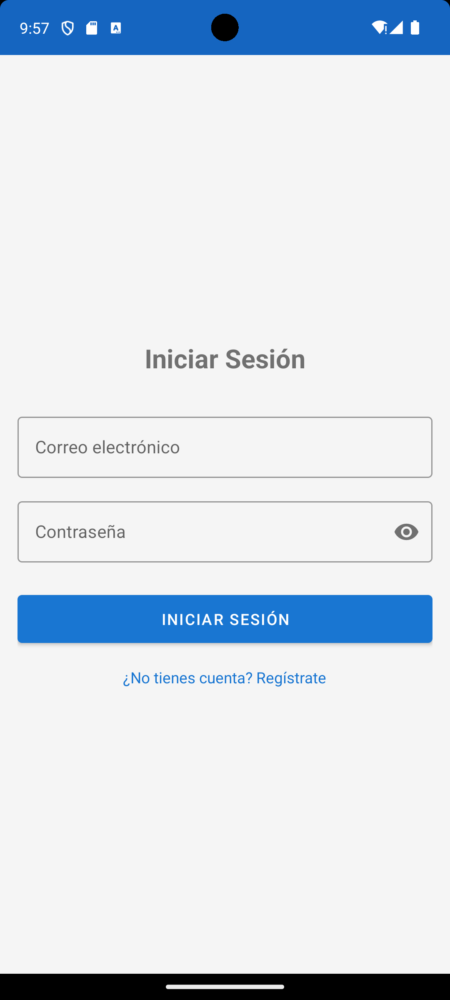
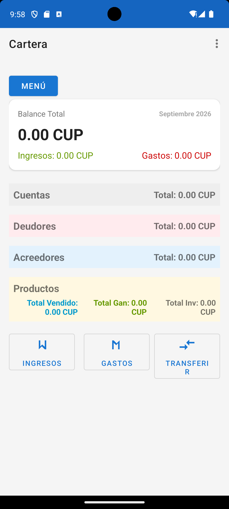
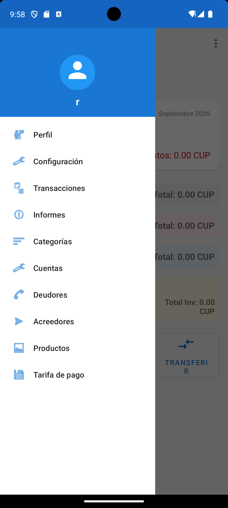
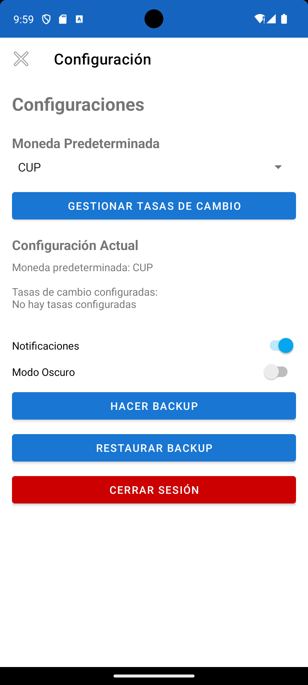

# Cartera - Android App

Aplicación Android para gestión personal de finanzas, inventario y control de deudas/acreedores.

> **Nota:** Este repositorio contiene el código fuente completo de la aplicación Cartera. Puedes explorar toda la arquitectura y el código directamente en las carpetas del proyecto.

## 📋 Descripción

Cartera es una aplicación móvil desarrollada en Kotlin que permite llevar un control completo de las finanzas personales, incluyendo gestión de cuentas bancarias, registro de transacciones, control de inventario de productos, seguimiento de deudores y acreedores, y generación de reportes.

## ✨ Características

### Gestión Financiera
- **Cuentas:** Creación y gestión de múltiples cuentas con soporte multi-moneda.
- **Transacciones:** Registro de ingresos y gastos con categorización.
- **Tasas de cambio:** Configuración de tasas de conversión entre monedas.
- **Categorías:** Personalización de categorías para organizar transacciones.

### Control de Deudas y Acreedores
- **Personas Relacionadas:** Registro de deudores y acreedores.
- **Seguimiento de montos:** Control de saldos pendientes.
- **Historial:** Registro de fechas y descripciones de deudas.
- **Liquidación:** Sistema para liquidar deudas pendientes.

### Gestión de Inventario
- **Productos:** Control de inventario con cantidades y unidades.
- **Precios:** Registro de precios de compra y venta.
- **Ventas:** Sistema de registro de ventas de productos.
- **Cuentas de ganancia:** Configuración de cuentas para depósito de ganancias.

### Reportes
- **Reportes financieros:** Visualización de balances y movimientos.
- **Cortes de productos:** Reportes de ventas por producto.

### Sistema de Usuarios
- **Autenticación:** Sistema de login y registro.
- **Perfil:** Gestión de información de usuario.
- **Configuración:** Personalización de preferencias.
- **Backup y restauración:** Exportación e importación de datos.

## 🛠️ Stack Tecnológico

- **Lenguaje:** Kotlin
- **SDK Mínimo:** Android 7.0 (API 24)
- **SDK Objetivo:** Android 14 (API 34)
- **Arquitectura:** Room Database, ViewBinding, Patrón DAO
- **Dependencias principales:**
  - AndroidX Core KTX
  - AndroidX AppCompat
  - Material Design Components
  - Room Runtime & KTX (v2.6.1)
  - Lifecycle Runtime KTX

## 📱 Estructura del Proyecto
app/src/main/java/cu/rge/cartera/
├── data/
│ ├── model/ # Modelos de datos (Entity)
│ ├── dao/ # Data Access Objects
│ └── DataManager.kt # Gestor central de datos
├── navigation/ # Sistema de navegación
├── *Activity.kt # Actividades de la aplicación
└── *Adapter.kt # Adaptadores para listas

### Modelos de Datos Principales

- **Account:** Cuentas bancarias con moneda y saldo.
- **Transaction:** Registro de movimientos financieros.
- **Producto:** Items de inventario con precios.
- **PersonaRelacionada:** Deudores y acreedores.
- **TarifaPago:** Configuración de tarifas.
- **Category:** Categorías de transacciones.
- **CurrencyRate:** Tasas de cambio de moneda.
- **User:** Usuarios del sistema.

## 📸 Capturas de Pantalla

*   **Iniciar Sesión:** 
*   **Dashboard Principal:** 
*   **Menú de Navegación:** 
*   **Configuración y Backup:** 

## 🚀 Instalación

1. Clonar el repositorio:
   ```bash
   git clone https://github.com/Reynel1986/Cartera.git

    Abrir el proyecto en Android Studio.

    Sincronizar dependencias de Gradle.

    Ejecutar en un dispositivo físico o emulador (API 24+).

🔐 Seguridad

    Base de datos local (Room) con persistencia segura.

    Sistema de autenticación de usuarios.

    Cifrado de credenciales.

🗺️ Roadmap

Posibles mejoras futuras:

    Exportación de datos a CSV/PDF.

    Sincronización en la nube.

    Gráficos y estadísticas avanzadas.

    Notificaciones de pagos pendientes.

    Soporte para transacciones recurrentes automáticas.

👨‍💻 Autor

Desarrollado por Reynel González Estévez (RGE) para gestión personal de cuentas y finanzas.
📄 Licencia

Este proyecto está disponible como muestra de portafolio. Todos los derechos reservados.
